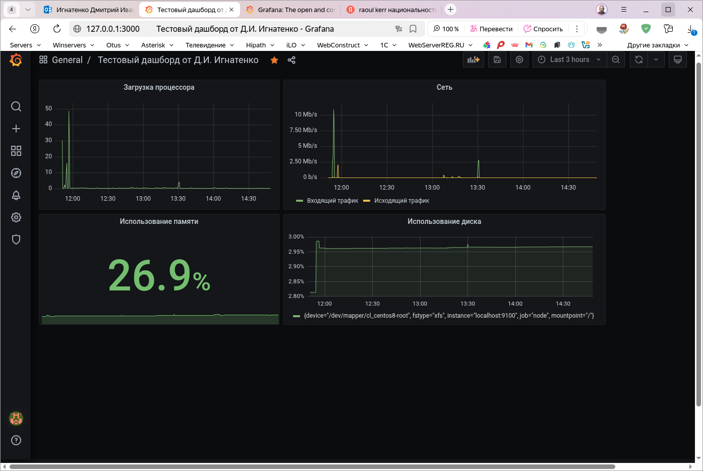

# Домашнее задание №22 по теме Prometheus

### Задание: Настройка мониторинга
Настроить дашборд с 4-мя графиками
- память;
- процессор;
- диск;
- сеть.

### Установка системы мониторинга.
Создадим [Vagrantfile](./Vagrantfile) для установки системы мониторинга на виртуальную машину.
Для мониторинга используем связку prometheus - grafana.

После установки создаем дашбор ди добавляем в него требуемые панели. Для панелей используем сл.запросы:
##### память: 

    100 - (node_memory_MemAvailable_bytes / node_memory_MemTotal_bytes * 100);
  
##### процессор:

    100 - (avg by (instance) (rate(node_cpu_seconds_total{mode="idle"}[$__rate_interval])) * 100);
    
##### диск:

    100 - ((node_filesystem_avail_bytes{mountpoint="/",fstype!="tmpfs"} / node_filesystem_size_bytes{mountpoint="/",fstype!="tmpfs"}) * 100);
  
##### сеть:

    Входящий трафик: rate(node_network_receive_bytes_total{device!="lo"}[$__rate_interval]) * 8;
    Исходящий трафик: rate(node_network_transmit_bytes_total{device!="lo"}[$__rate_interval]) * 8.

В результате получим вот такой дашборд.

 
