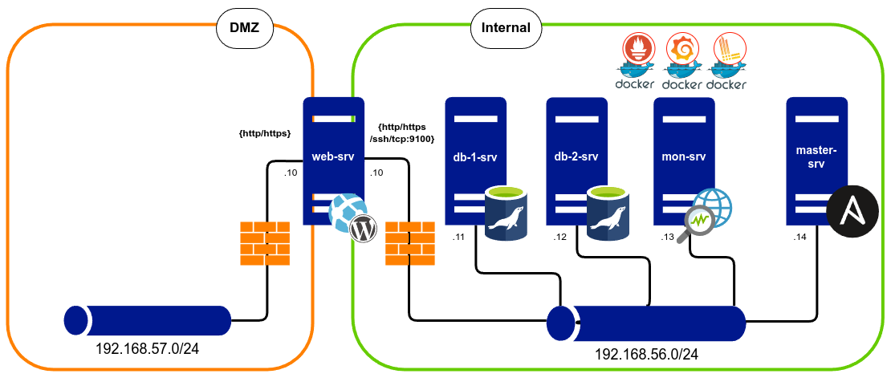

# Заметки на полях

## Схема стэнда

    sudo dnf update -y
    sudo dnf install epel-release -y
    sudo dnf install ansible git vim python3 python3-pip -y
  
### Генерация и деплой ключей на сервера 
 
    ssh-keygen -t ed25519 -C "vagrant@master-srv"
  
    echo "ssh-ed25519 AAAAC3NzaC1lZDI1NTE5AAAAIDCM3Xy/GdDT43tdNpMe5GRCqlmZcRmJZsARqFahF73R vagrant@master-srv" >> ~/.ssh/authorized_keys
  
### Порядок запуска playbooks
  
    ansible-playbook -i inventory.yml playbooks/bootstrap.yml
    ansible-playbook -i inventory.yml playbooks/common.yml
    ansible-playbook -i inventory.yml playbooks/promtail.yml
    ansible-playbook -i inventory.yml playbooks/monitoring.yml

### Запуск скрипта для листинга бэкапов
    sudo /usr/local/bin/list-backups.sh

## Восстановление компонентов

### Пример запуска через скрипт
    sudo /usr/local/bin/restore.sh /opt/backups/mysql/20250928_020001/ db
    sudo /usr/local/bin/restore.sh /opt/backups/wordpress/20250928_020001/ web  
    sudo /usr/local/bin/restore.sh /opt/backups/monitoring/20250928_020001/ monitoring
    sudo /usr/local/bin/restore.sh /opt/backups/ full 20250928_020001

### Пример запуска через Ansible
    ansible-playbook playbooks/restore.yml -e "restore_component=db"
